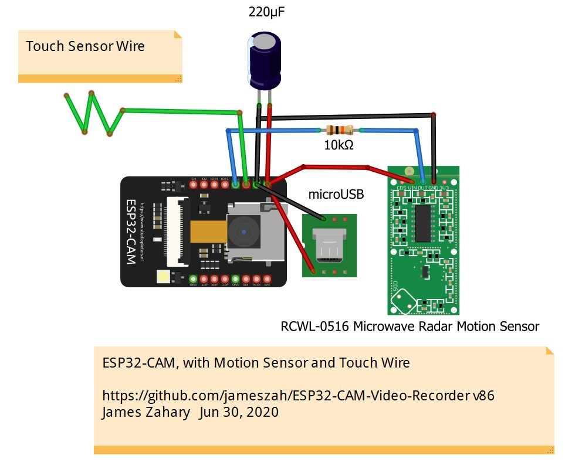
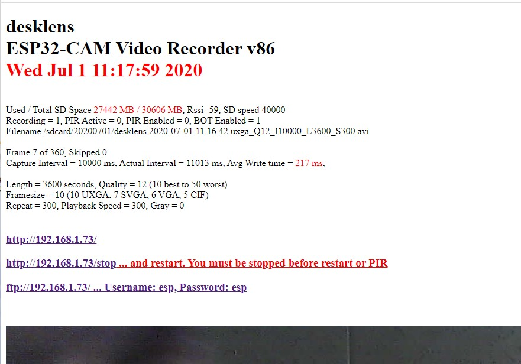
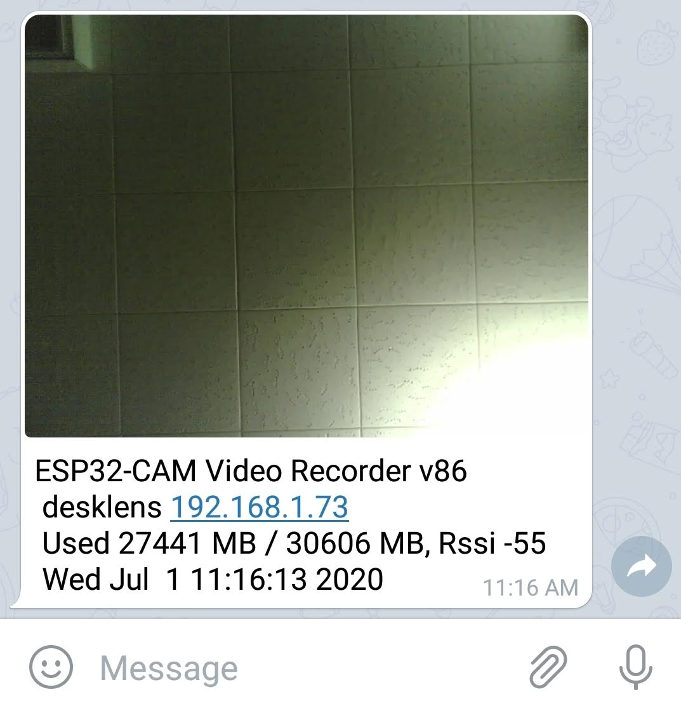

# ESP32-CAM-Video-Recorder
Video Recorder for ESP32-CAM with http server for config and ftp server to download video

TimeLapseAvi

  ESP32-CAM Video Recorder

  This program records an MJPEG AVI video on the SD Card of an ESP32-CAM.
  
  by James Zahary July 20, 2019
     jamzah.plc@gmail.com

  https://github.com/jameszah/ESP32-CAM-Video-Recorder
  
  jameszah/ESP32-CAM-Video-Recorder is licensed under the GNU General Public License v3.0

## Update Jul 15, 2020 Version 89 - more new stuff

- added some code to save the configuration in eprom, so your device will always reboot to the state it was in from the most recent /start command.  The previous system just had a hardcoded configuration, and let you /stop and /start in a new configuration, but after a series of squirrel attacks, I moved to the eprom solution.  It always starts where it was, although a movie in progress during the squirrel attack will be lost. You can enable or disable the telegram bot or PIR sensor with a web-page click, and that too will be added to the eprom, so it reboots with or without bot updates or PIR control.  On reboot, it will check your eprom to see if there are parameters, and if so it will use them, or else use the hardcoded parameters from settings.h, and then write those paramters into eprom for next boot.  Change the eprom parameters with the /start command below.

- changed the movie start procedure a little.  It now takes a snapshot at beginning of movie, saves it as a .jpg, and if Telegram bot is enabled sends that same picture to your telegram so you can monitor the activity on your phone, or use that jpg if you want.  It does take several seconds to send the picture to telegram.  And only after that does it start recording the movie.  I attempted to do the telegram send after the movie started recording, but the telegram uses SSL security which needs 50k or more of heap, which would sometimes leave too little heap to work the SD card.  Also the reboot from deepsleep takes a couple seconds, then starting internet takes a couple seconds, then telegram bot takes a couple seconds, and then the movie starts.  So if you want fast-start, then don't use deepsleep, turn off internet, and obviously turn off telegram.

- changed reprogramming the camera a little.  It used to re-set frame-size, quality with every movie, but now it is just when you make changes and at reboot.

- I have switched to quality = 12 which is better for sunny days, and does noticably increase frame-rate.  I can usually get SVGA working at 10 frames per second, which is decent realtime video.

  - http://desklens.local/bot_enable
  - http://desklens.local/bot_disable
  - http://desklens.local/pir_enable
  - http://desklens.local/pir_disable
   
  - http://desklens.local/ ... look through viewfinder and see status
    
  - http://desklens.local/stop
  - http://desklens.local/start  ... with existing or default parameters
  - http://desklens.local/start?framesize=VGA&length=1800&interval=250&quality=10&repeat=100&speed=1&gray=0&pir=0&bot=1

    -  framesize can be UXGA, SVGA, VGA, CIF 
    -  length is length in seconds of the recording
    -  interval is the milli-seconds between frames 
    -  quality is a number 10..50 for the jpeg  - smaller number is higher quality with bigger and more detailed jpeg 
    -  repeat is a number of who many of the same recordings should be made
    -  speed is a factor to speed up realtime for a timelapse recording - 1 is realtime 
    -  gray is 1 for a grayscale video 
    -  pir is 1 to start a 15 seconds movie if pir sensor pulls high, and continue to 10 seconds after pir goes low
    -  bot is 1 will send the opening frame of movie to your Telegram App

  - ftp://desklens.local/ ... use ftp to download or erase old files ... username and password "esp" which is set in the code

The serial debug monitor shows you your ip address, and the web page uses the ip, rather than hoping that you can resolve mDNS everytime.

## Update Jun 30, 2020 Version 86 - some new features

 # Software   
- redo camera scheduler to reduce frame skips with slight delays between frames
- move more processing to separate priority tasks, and remove from idle loop()
- most tasks suspend waiting for events, rather than looping checking for events, ... except ftp which still loops wating for ftp requests
- added a sd card snapshot jpg at beginning of every movie
- added a telegram.org message with opening picture and info about diskspace and rssi to follow camera activity on your computer or phone
- added deepsleep feature to wake on PIR, and then deepsleep after movie is recorded
- added touch sensor on pin12 to enable/disable the pir sensor 
- added more careful setup of difficult pins 12, 13, and 4 - used for SD and re-used for PIR, Touch, and Blinding Disk-Active Light
- added brownout handler to close files on brownout, which didn't work, but at least I can deepsleep to prevent multiple brownout reboots.  (Inside a brownout handler, you have only 300ms and you cannot access wifi, sd, or flash, ... so cannot close files, or send message.)
- re-used pin 4 Blinding Disk-Active Light to blink gently at beginning of movie, and at a Touch - ironically, also turns on during Brownout ;-)
- added several functions to enable / disable pir or bot using internet
   
  - http://desklens.local/bot_enable
  - http://desklens.local/bot_disable
  - http://desklens.local/pir_enable
  - http://desklens.local/pir_disable
    
  - http://desklens.local/ ... look through viewfinder and see status
    
  - http://desklens.local/stop
  - http://desklens.local/start  ... with existing or default parameters
  - http://desklens.local/start?framesize=VGA&length=1800&interval=250&quality=10&repeat=100&speed=1&gray=0 
    - see below or settings.h
     
- moved many settings to a separate file "settings.h" so you edit that, rather than digging through the main file to set your wifi password, startup defaults, and enable/disable internet, pir, telegram, etc
- not super-elegant code ... still haven't written the avi writer into a nice library
- read comment on rtc_cntl.h below which may or may not be updated in the esp32 board library - links and info below 
- This includes a v1.2 (slight mods) of https://github.com/witnessmenow/Universal-Arduino-Telegram-Bot for the Telegram stuff, plus the ftp and ArduCam mentioned below (major rewrite on ArduCam) 
- You just need the files from the /v86 folder. Edit the settings.h file for your wifi and starup configuration.
   
 # Hardware   
- to use PIR function, put an active high PIR or microwave on pin 13 with a 10k resistor (brown,black,orange) between pin 13 and PIR output to avoid antagonizing sd card
- to use Touch function, put a wire (with optional metal touch point) on pin 12 and touch it to enable/disable pir
- Blinding Disk-Active Light will give little blink during a touch, or when starting a recording
- red led on back with blink with every frame if you have that enabled in settings

Here is the "/" status page

And the /stop page to restart with new parameters 

And what it looks like on your phone Telegram App

## Update Feb 29, 2020 Sample Hardware for Microwave Camera

This is a bit of hardware to set up a camera recording to SD Card whenever something moves, as seen through a microwave device, and adds a led so you can see when the camera sees you!

## Update Feb 25, 2020 Sample Hardware for PIR Camera

This is a bit of hardware to set up a camera recording to SD Card whenever something moves.

(my microUSB adapter is different from the one in the library)

## Update Feb 26, 2020 TimeLapseAvi60x.ino

New version # 60
- moved from 4 bit SD access to 1 bit, which frees up gpio pins 4, 12, and 13
- the Blinding Disk-Access Light is now OFF, without soldering or tape
- pin 12 can now be used for a PIR or switch - pull it high to start a 15 second video, continuing until 10 seconds after it goes low
- to use PIR or switch, the machine must not be recording, so edit "record_on_reboot" to 0, or use web to stop recording
- if you want no internet, just leave the fake ssid and password, and it will date your PIR recordings as 1970, but keep all your PIR clips timed and dated after 1970, which is better than just numbering them
- default startup is VGA, 10 fps, quailty 10, 30 minutes long, playback realtime, repeat 100 times, and it starts automatically after a reboot -- this is actually a little aggressive for my LEXAR 300x 32GB microSDHC UHS-I, which will usually keep up with 10 fps, but will sometimes start skipping
- BlinkWithWrite #define of 1 will blink the little red led with every frame, or #define 0 will just blink SOS if the camera or sd card are broken, or if you are skipping frames because sd cannot keep up
- also implemented dates and times in ftp which had been mysteriously missing.  The "Date Modified" on Windows should now be the correct time the file was completed on the ESP32.  The "Date Created" will be the time you ftp'ed it.  And the time in the file name is the time the file was started recording on the ESP32.
- also note that the file names of the PIR files are all just "L15" (the original creation of the file), but the files themselves will be as long as the PIR had activity.  I haven't updated the filename for the eventual length.
- you just need the 3 files from the /v60 folder
- I'll rewrite this intro with v60 instructions ... at some point

Also, someone did an instructables.com explanation and video about the Sep 15, 2019 version, which is not bad.  
I am refered to as "The Team"   :-)

https://www.instructables.com/id/Video-Capture-Using-the-ESP32-CAM-Board/

Other general advice about the ESP32-CAM.
- put a capacitor between the +5 and Ground to prevent the frequent "brownout" problems.  I saw 220 microFarad recommended somewhere, and it works good.
- keep the antenna part of the chip - the part with the squiggly line - above and away from your circuit board or any wires.  The internet speed will improve dramatically with just 1 or 2 mm of extra space.
 
## Update Feb 18, 2020
- Check out https://github.com/s60sc/ESP32-CAM_MJPEG2SD

It is a similar program, but makes a ".mjpeg" file rather than an ".avi" file.

It will also give you the live-stream through the camera to your 
browser, it will play the videos for you through the browser, and 
it will record based on a PIR or other sensor that grounds a pin.

And it solves the "Blinding Disk-Active Light" without any soldering or tape.

Reference by amirjak over in the "Issues" section.

I will be borrowing a few of these good ideas in days to come!

## Update Oct 15, 2019
- Make sure you are using esp32 board library 1.03 or better
- 1.02 has major wifi problems !!!

## Update Sep 15, 2019 TimeLapseAvi39x.ino
"work-in-progress"  I'm publishing this as a few people have been asking or working on this.
- program now uses both cores with core 0 taking pictures and queueing them for a separate task on core 1 writing them to the avi file on the sd card
- the loop() task on core 1 now just handles the ftp system and http server
- dropped fixed ip and switch to mDNS with name "desklens", which can be typed into browser, and also used as wifi name on router
- small change to ftp to cooperate with WinSCP program
- fixed bug so Windows would calulcate the correct length (time length) of avi
- when queue of frames gets full, it skips every other frame to try to catch up
- camera is re-configued when changing from UXGA <> VGA to allow for more buffers with the smaller frames
    
    You just need the 3 files in the /v23 folder for July version, which takes a picture and stores it
    or the 3 files in the /v39 folder for the current which adds the queueing system to get better
    frame rates, and keep recording if there is a small delay on file system.
 
##  Original July 2019 Intro

  Acknowlegements:

  1.  https://robotzero.one/time-lapse-esp32-cameras/
      Timelapse programs for ESP32-CAM version that sends snapshots of screen.
  2.  https://github.com/nailbuster/esp8266FTPServer
      ftp server (slightly modifed to get the directory function working)
  3.  https://github.com/ArduCAM/Arduino/tree/master/ArduCAM/examples/mini
      ArduCAM Mini demo (C)2017 LeeWeb: http://www.ArduCAM.com
      I copied the structure of the avi file, some calculations.

  The is Arduino code, with standard setup for ESP32-CAM
    - Board ESP32 Wrover Module
    - Partition Scheme Huge APP (3MB No OTA)
    
  This program records an AVI video on the SD Card of an ESP32-CAM.
  
  It will record realtime video at limited framerates, or timelapses with the full resolution of the ESP32-CAM.
  It is controlled by a web page it serves to stop and start recordings with many parameters, and look through the viewfinder.
  
  You can control framesize (UXGA, VGA, ...), quality, length, and fps to record, and fps to playback later, etc.

  There is also an ftp server to download the recordings to a PC.

  Instructions:

  The program uses a fixed IP of 192.168.1.222, so you can browse to it from your phone or computer.
  
  http://192.168.1.222/ -- this gives you the status of the recording in progress and lets you look through the viewfinder

  http://192.168.1.222/stop -- this stops the recording in progress and displays some sample commands to start new recordings

  ftp://192.168.1.222/ -- gives you the ftp server

  The ftp for esp32 seems to not be a full ftp.  The Chrome Browser and the Windows command line ftp's did not work with this, but
  the Raspbarian command line ftp works fine, and an old Windows ftp I have called CoffeeCup Free FTP also works, which is what I have been using.
  You can download at about 450 KB/s -- which is better than having to retreive the SD chip if you camera is up in a tree!
  
http://192.168.1.222/start?framesize=VGA&length=1800&interval=250&quality=10&repeat=100&speed=1&gray=0  
-- this is a sample to start a new recording

- framesize can be UXGA, SVGA, VGA, CIF (default VGA)
- length is length in seconds of the recording 0..3600 (default 1800)
- interval is the milli-seconds between frames (default 200)
- quality is a number 10..50 for the jpeg  - smaller number is higher quality with bigger and more detailed jpeg (default 10)
- repeat is a number of who many of the same recordings should be made (default 100)
- speed is a factor to speed up realtime for a timelapse recording - 1 is realtime (default 1)
- gray is 1 for a grayscale video (default 0 - color)

These factors have to be within the limit of the SD chip to receive the data.
For example, using a LEXAR 300x 32GB microSDHC UHS-I, the following works for me:

- UXGA quality 10,  2 fps (or interval of 500ms)
- SVGA quality 10,  5 fps (200ms)
- VGA  quality 10, 10 fps (100ms)
- CIF  quality 10, 20 fps (50ms)

If you increase fps, you might have to reduce quality or framesize to keep it from dropping frames as it writes all the data to the SD chip.

Also, other SD chips will be faster or slower.  I was using a SanDisk 16GB microSDHC "Up to 653X" - which was slower and more unpredictable than the LEXAR ???

Search for "zzz" to find places to modify the code for:
1.  Your wifi name and password
2.  Your preferred ip address (with default gateway, etc)
3.  Your Timezone for use in filenames
4.  Defaults for framesize, quality, ... and if the recording should start on reboot of the ESP32 without receiving a command
  
Sample videos produced by the program in the /sample-output folder -- it is not GoPro quality, but then GoPro's don't cost $10.

While not necessay, following is how I dealt with the "Flash" led on the front of the ESP32-CAM chip.

Picture below shows my solution to the "Flash" led, aka "the Blinding Disk-Active light".  The led turns on whenever you are are writing data to the SD chip, which is normally after you have taken the picture, so you don't need the flash on any more!  

Quick de-solder of the collector on the top of the J3Y transistor just above the led, then put in some tape to keep it clear -- you can solder it back later if you want to use it.

