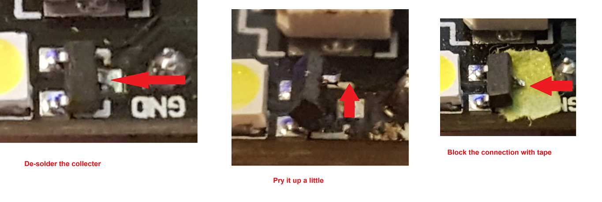

# ESP32-CAM-Video-Recorder
Video Recorder for ESP32-CAM with http server for config and ftp server to download video

(software coming tomorrow)

Sample videos produced by the program in the /sample folder -- it is not GoPro quality, but then GoPro's don't cost $10.

Picture below shows my solution to the "Flash" led, aka "the Blinding Disk-Active light".  The led turns on whenever you are are writing data to the SD chip, which is normally after you have taken the picture, so you don't need the flash on any more!  

Quick de-solder of the collector on the top of the J3Y transistor just above the led, then put in some tape to keep it clear -- you can solder it back later if you want to use it.

